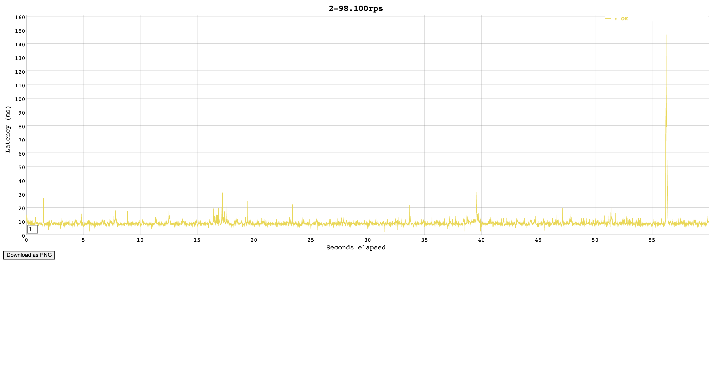
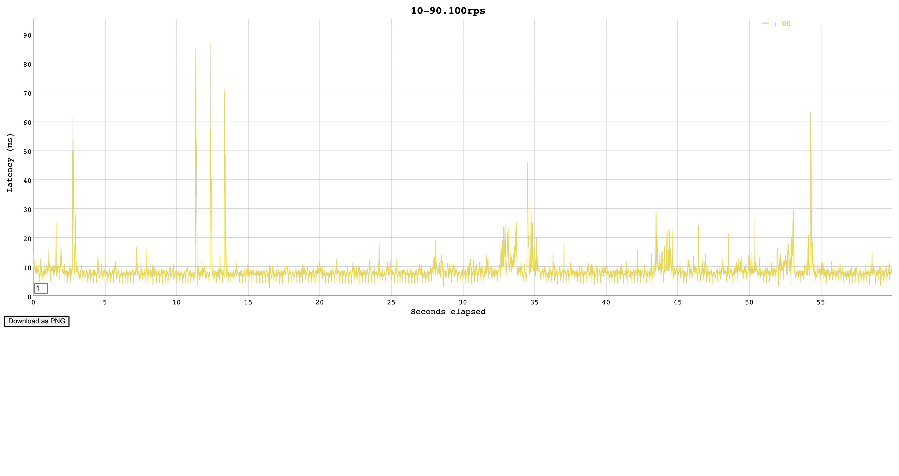
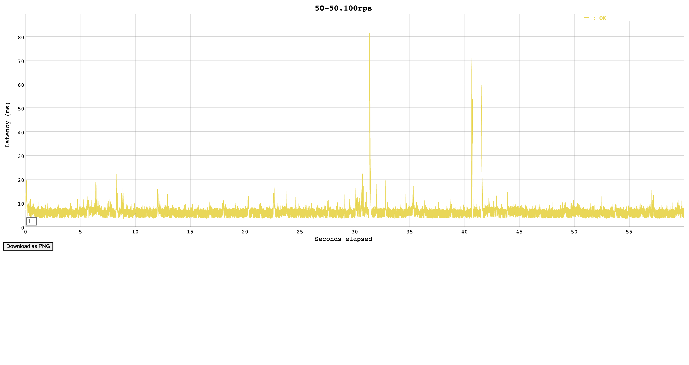
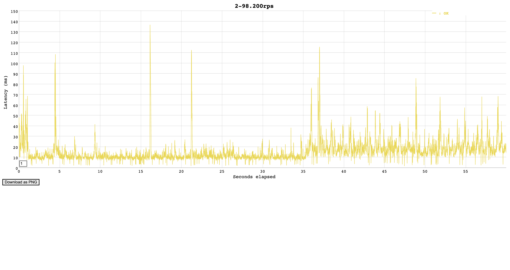
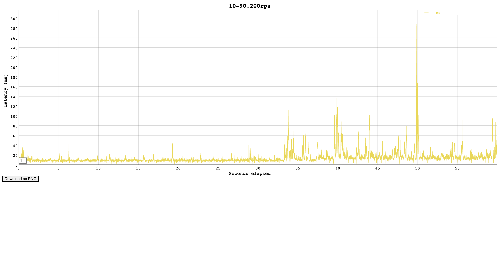
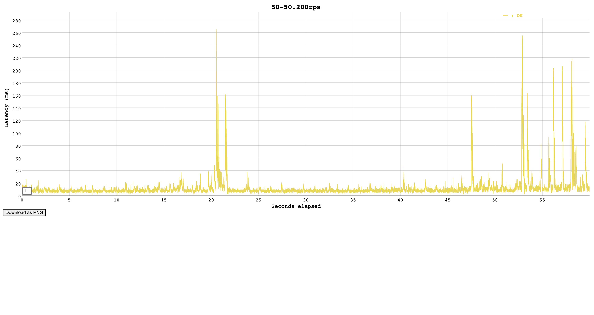

# Тестовое задание для стажёра Backend-направления (зимняя волна 2025)

Запуск сервиса

```sh
# Сгенерируем ключи для JWT
make make_jwt_keys
# Запустим контейнеры в docker-compose
docker-compose up
```

## Архитектура сервиса

Используется clean-architecture с четким разделением на слои:
- сущности - internal/model
- сценарии - internal/usecase
- интерфейс-адаптеры и фреймворки/драйверы - internal/infrastructure, internal/repository, internal/api

## Качество кода

Для проверки качества кода используется [golangci-lint](https://github.com/golangci/golangci-lint)
с расширенным набором линтеров. Нужно установить его в системный path и запускать `make lint`.

Тестовое покрытие (с учетом интеграционных тестов репозиториев) - `47.5%`.

Интеграционные тесты API расположены в `test/load`, можно отдельно запустить используя `make test-api`,
покрыты все основные сценарии.

Для репозиториев `./internal/repository` используются интеграционные тесты, которые проверяют работу с базой данных.

## Нагрузочное тестирование

Для нагрузочного тестирования подготовлены несколько профилей нагрузки:

- 10% write/90% read
- 50% write/50% read

В файле `test/load/generate_targets.go` написан скрипт для генерации http запросов.
Он создает N пользователей, например 10 тыс., и записывает http запросы с авторизационными токенами в файлы
`targets_2-98`, `targets_10-90` и `targets_50-50`. Можно использовать команду `make load-generate-target`.

В качестве тулзы для генерации нагрузки выбрана [vegeta](https://github.com/tsenart/vegeta).
Можно использовать команды `make load-test-2-98`, `make load-test-10-90` и `make load-test-50-50` для воспроизведения.
`make load-test-plot` для рендеринга графиков.

### Результаты

Читающие запросы /api/info достаточно сложные - состоят из 3 запросов в БД,
поэтому в части конфигурациях варианты с большим чтением имеют большие latency.

Узким местом в данной системе является база данных.
Запуск производился в локальном окружении с использованием виртуализации
без попыток оптимизации БД.

| rps | r/w   | 95% ms | 99% ms | 99.9% ms | 99.99% ms |
|-----|-------|--------|--------|----------|-----------|
| 100 | 2/98  | 10.896 | 15.00  | 87.4     | 144.4     |
| 100 | 10/90 | 12.635 | 27.17  | 69.5     | 86.6      |
| 100 | 50/50 | 9.391  | 15.05  | 58.5     | 80.5      |
| 200 | 2/98  | 32.449 | 57.58  | 112.5    | 135.0     |
| 200 | 10/90 | 30.932 | 68.43  | 126.3    | 261.2     |
| 200 | 50/50 | 23.246 | 89.85  | 193.3    | 256.8     |

С production ready сетапом postgres система сможет
соответствовать заявленным требованиям: 1k RPS, 99.99%, 50 мс.

Кроме этого можно в зависимости от профиля нагрузки использовать кэширование
для ускорения чтения.

100rps







200rps






